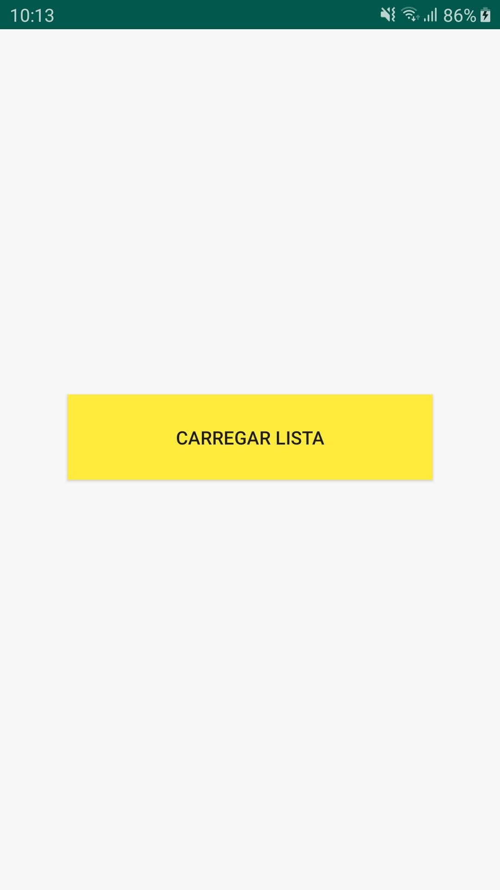
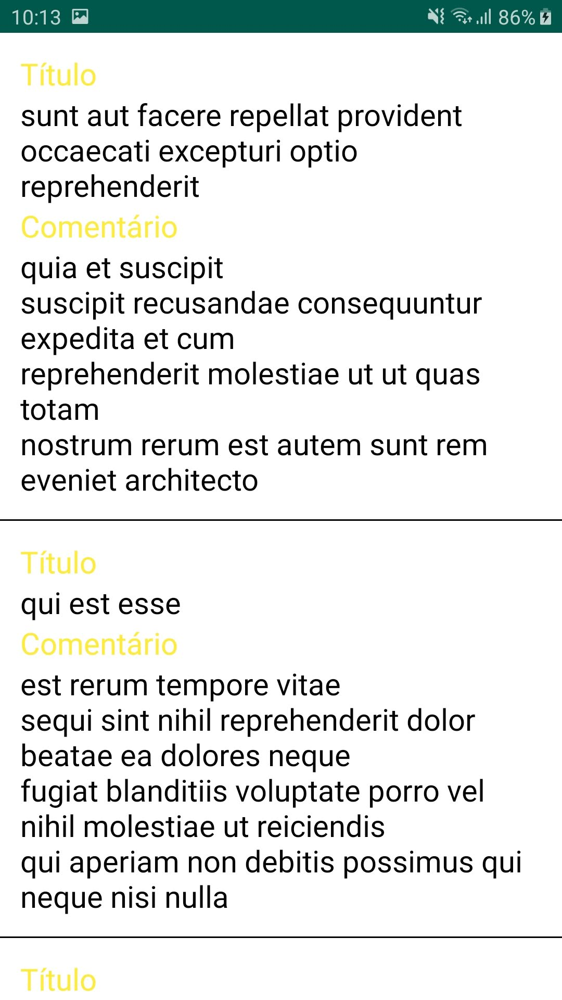

# Lista de Posts

  Aplicativo simples feito em MVP para treinar a arquitetura e o consumo de uma API (Retrofit)
   
  Link da API utilizada: <https://jsonplaceholder.typicode.com/posts>
   
   
  |
